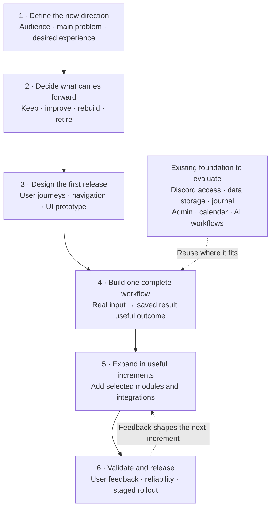

# OMENSITE project evolution roadmap

Updated: September 24, 2026

Status: Initial planning draft; awaiting the new product idea.

Baseline inspected: `760ee3a` / application version `0.1.2`.

## Direction

Evolve the existing project into the new concept. Reconsider the UI, navigation, and workflows freely; assess existing services and stored records for reuse against that concept. A feature's presence in the current application does not automatically give it a place in the next version.

This roadmap establishes the working sequence. Feature scope, final architecture, dates, and effort estimates remain open until the intended users and first useful release are defined. The current inventory comes from source and documentation review, not a fresh runtime or production validation.

## Visual roadmap

## What exists today

These are reuse candidates and open decisions, not commitments to preserve the current product structure.

| Area | Evidence in the repository | Decision for the new direction |
| --- | --- | --- |
| Application foundation | Express/EJS pages; separate routes, controllers, services, repositories; progressive navigation | Evaluate how far this structure supports the proposed experience before deciding on a framework change. |
| Identity and access | Discord OAuth, roles, capability checks, session revocation, CSRF protection | Reuse if Discord and the role model fit the intended audience; plan identity continuity if they change. |
| Persistent records | PostgreSQL repositories and migrations for journals, Admin, Brain, and broker workspaces | Identify records to preserve and any schema changes before implementation. |
| Journal | Create/list/detail workflows, authenticated API, structured records | Define the desired capture and review experience; determine gaps such as imports and richer evidence. |
| Administration | User/session/ban management and indicator-request decisions | Retain the operational controls required by the next version; redesign their presentation as needed. |
| Indicators | Catalog and access requests; TradingView access grants remain manual | Decide whether indicators belong in the first release and what access experience is needed. |
| Market calendar | External calendar adapter, filtering, caching, stale-state handling | Decide whether the new product needs this calendar, broader market context, or both. |
| Trader and Brain | Provider adapters, research workflows, risk checks, memory, human review, offline evaluations | Decide the user-facing AI job and whether the two workspaces should merge, stay separate, or be reduced. Paid calls are locked by default; live quality is unverified in this review. |
| Robinhood | Connection, tool discovery, research snapshots, action previews, review queue, activity storage | Decide its release priority. Authenticated compatibility and execution readiness need separate validation; automatic journal fill synchronization is not implemented. |
| Home and alerts | Home contains placeholder activity/status; ICT and support/resistance alert pages have standby controls | Define meaningful home content. Treat operational alerts as new implementation work, not a completed engine. |
| UI and navigation | Terminal/CRT presentation, animated login/transitions, EJS layouts, page controllers, CSS | Reconsider the entire experience after defining the core journeys. Existing styling is not a constraint. |
| Delivery and verification | Automated test files, Docker/hosting configuration, migration guard, health checks | Establish a fresh baseline during implementation; extend checks around changed behavior and release requirements. |

## Milestones and completion conditions

| Phase | Work | Concrete output | Complete when |
| --- | --- | --- | --- |
| **1. New direction — start here** | Capture the idea, primary user, problem, desired outcome, essential features, and exclusions. | A concise product brief and one first-release goal. | We can describe who the product helps and the main task they can finish in the first release. |
| **2. Carry-forward decisions** | Compare each proposed capability with the inventory; examine data, access, integration, and cost dependencies. | A keep/improve/rebuild/retire map and a prioritized backlog. | Each first-release capability has a disposition, known dependencies, and unresolved questions recorded. |
| **3. Experience and structure** | Map key journeys, page hierarchy, navigation, desktop/mobile needs, and loading/error/empty states. Prototype the core flow and check backend feasibility. | A reviewable prototype, UI conventions, and a justified technical approach. | The main journey makes sense from start to finish and its required data is identified. |
| **4. First complete workflow** | Implement one valuable journey across interface, service, storage, and permissions. Reuse compatible components. | One demonstrable increment using real application records, with relevant checks. | The target user can complete the task and recover the saved result; access and failure cases behave as intended. |
| **5. Expand by priority** | Implement the next selected capability, resolve its dependencies, review it, and repeat. | Small, usable increments with acceptance criteria and updated documentation. | Every first-release requirement meets its own acceptance criteria; deferred ideas remain visible. |
| **6. Validate and release** | Run appropriate regression checks, obtain user feedback, address usability/reliability gaps, validate integrations in scope, and prepare migration and rollback steps. | A beta candidate, documented release checks, and a staged rollout plan. | The agreed core journeys work, required data survives the release, significant blockers are resolved, and the release can be operated and recovered. |

Phases are dependency order, not time estimates. Design and technical investigation may overlap. Validation happens throughout implementation; the last phase brings the release checks together. Any unresolved integration essential to the core journey should be investigated before substantial UI implementation.

## How each new idea becomes work

For every idea, record:

1. **Outcome:** Who needs it, and what can they accomplish?
2. **Current fit:** What exists, and what is missing?
3. **Disposition:** Keep, improve, rebuild, build new, retire, or defer.
4. **Dependencies:** Required data, permissions, integrations, or earlier features.
5. **Release priority:** First release, next increment, or later exploration.
6. **Acceptance:** Observable conditions that make the feature complete.

Use the same backlog throughout the project. Split large ideas into increments that can be demonstrated independently. Revisit priorities when the direction changes, rather than treating every idea as a first-release requirement.

| Item | Disposition | Priority / dependency | Acceptance | Status |
| --- | --- | --- | --- | --- |
| New product brief | Define | First / user concept | Primary user, main outcome, essential capabilities, and exclusions recorded | Awaiting concept |
| Existing capability inventory | Review | First / source inspection | Existing implementations and visible gaps documented | Initial review complete; runtime validation pending |
| UI and navigation | Reconsider | After product brief and core journeys | Reviewable prototype supports the chosen first-release workflow | Open |
| First end-to-end workflow | Select | After scope and feasibility | One valuable task works across UI, services, permissions, and storage | Not selected |

## Decisions still open

- What is the new concept, and who is the primary user?
- What should that user accomplish first?
- Which current features are essential, optional, or no longer relevant?
- What should the experience feel like, and which devices matter most?
- What existing user records and access arrangements must carry forward?
- What budget, launch timing, and external-service constraints should shape scope?

The next input can be an informal description. It does not need to answer every question. Turn that description into a product brief, then replace the provisional backlog with specific features and dependencies.

## Source references

- [Current product and setup](../README.md)
- [Application assembly](../src/app.js) and [module navigation](../src/models/navigation.js)
- [Journal API](../src/controllers/journal-api-controller.js) and [journal routes](../src/routes/journal-routes.js)
- [Home](../views/pages/home.ejs), [ICT alerts](../views/pages/alerts-ict.ejs), and [support/resistance alerts](../views/pages/alerts-sr.ejs)
- [Brain implementation and limits](agent-brain.md)
- [Robinhood implementation and limits](robinhood.md)
